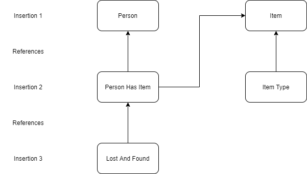

# Lost_And_Found
Database and web services project repo

### PDF folder
This folder contains the description of the project, the ER diagram and the mapping approach of our database schema.

### Project folder
This folder contains the file of the database diagram which was created in the MySQL Workbench program.

### Query Log folder
This folder contains the results of the queries after the database is populated with some random data. The results are stored in json format.

### SQL Scripts folder
This folder contains the SQL scripts for the creation of the database and all the tables it contains. The queries file contains some of the queris that are going to be used in the project. It contains mainly the select queries, since the insert queris are located in the python scripts files.

## Python Script folder

Contents:
    Data.txt
    Query_Definitions.py
    Query_Exec.py
    addmod.py
    adduser.py
    claimitem.py
    delitem.py
    queries.py
    repfound.py
    replost.py
    check.py
    send.py
## Screen folder
Contents:
addmod.html
adduser.html
claimitem.py
delitem.py
repfound.html
replost.html

### Query_Definitions:
Contains all relevant queries required to add to and modify entries in the database.
Contains functions that use the mysql connector api to connect to and send queries to the database.

### Data:
Contains data entries in the following format:

Name Surname Status Category Color SIze Date Location Description1 Description2\n

where description 1 and 2 are arbitary descriptions and are not required.

### Query_Exec:
Contains python functions to parse entries from the data folder into a list of dictionaries.
Each dictionary has the following key value structure:

{ Name: [], Surname: [], Status: [],  Category: [], Color : [],  SIze : [], Date : [],  Location : [],  Desc1 : [],  Desc2 : [] }

### Insersion Heierarchies:
Insersion is done in 3 steps:\

### HTML folder:
This folder contains the html files and the css file of the homepage , imprint page and the admin page. Some screenshots of the pages are stored in the screenshots folder.

### Link to our Website:
http://clabsql.clamv.jacobs-university.de/~emustafaj/

http://clabsql.clamv.jacobs-university.de/~emustafaj/imprint.html

http://clabsql.clamv.jacobs-university.de/~emustafaj/admin.html

### Link to Search page
http://clabsql.clamv.jacobs-university.de/~emustafaj/screens/search/main_search.html

### Admin
The admin table is the moderator table. It has the access to add user, delete item and other admin privileges.
Accessing the admin page was done by sending the link to the admin page to the admin's email. If the admin is on the database, then he/she will
receive a link, with a token generated with 128 bits, in his/her jacobs email.

### Taiyr has been assigned as one of the admin of the website. So, when logged in with his email, he will receive an email, which will redirect him to the maintenance page.
 
### Link to the admin login
http://clabsql.clamv.jacobs-university.de/~emustafaj/screens/admin/admin_login.html

### Web Statistics
The PDF file for the statistics can be found on the PDF directory.
The scripts used to generate the charts and the exraction of data from the error and access file can be found in log directory.
Matplot library was used to generate the chart.

### Autocomplete Search
In the search page you can search by a specific user or by a specific place. Suggestios will show according to the characters you will input.
The link to the page:
http://clabsql.clamv.jacobs-university.de/~emustafaj/screens/search/main_search.html
You can switch between searching by user and searching by place.

### Show Location
In the location page your location will show up in the map with a marker sign. 
If you click in the marker your IP address will show.
The link to the page:
http://clabsql.clamv.jacobs-university.de/~emustafaj/screens/show_location.py
